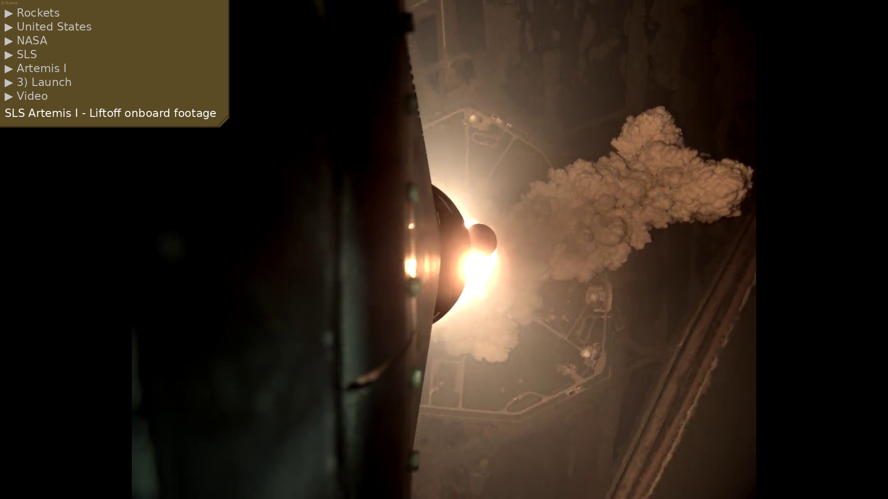

# SpaceScreensaver
<!-- markdownlint-disable MD033-->

**A Windows screensaver showing random images (and video stills), with an info box showing where the image was found.**

This can be useful to see additional context about an image, especially if a folder contains many photos in a tree-like structure with descriptive names (in my case, a collection of spaceflight images; hence the name).

Here, the randomizer ended up selecting a video and displaying a random frame from said video. Note how the infobox was placed in the least interesting corner of the image.

## Settings

- List of directories to choose images from
- List of subdirectories *not* to take images from
- Time between subsequent images
- Whether to show only high-resolution images (i.e. more than half the screen size in pixels)

Settings are stored in `Appdata/Local/Jonathan's Programma's/SpaceScreensaver/settings.json`.

There are 3 ways to open the Settings GUI:

- Just clicking "Settings..." in the Windows 'Screen Saver Settings' window. If you do not find this window, run `control desk.cpl,,@screensaver` using Win+R to open it.

- Right-click on `SpaceScreensaver.scr` and select "Configure".

- Running the command `SpaceScreensaver.scr /c`.

## Installation

### Recommended installation

1) Go to the '[releases](https://github.com/JonathanMaes/SpaceScreensaver/releases)' page here on GitHub and download the `.zip` file from the latest release.

2) Extract to a folder of your choice, where it can remain for eternity.

3) Right-click `SpaceScreensaver.scr` and select "Install". This opens the Windows 'Screen Saver Settings' window with SpaceScreensaver already selected.

4) Press "Apply". The screensaver is now selected.

You can now configure the screensaver to your liking, by clicking "Settings..." next to the dropdown menu. Be sure to click the green "Save settings" button before exiting the settings GUI.

### Alternative: using RunSaver

  
Click to show alternative installation method

If you are (righteously so) paranoid about running other people's compiled executables, then you can also run the source code directly from GitHub.

Note that this will require a python environment with at least the packages from `requirements.txt`.

The simplest way is to use the 'RunSaver' tool as your screensaver, and in RunSaver's settings select the `run.bat` file. This effectively makes Windows run `run.bat` as a screensaver. `run.bat`, in turn, activates the correct python environment and runs `main.pyw`.

1) Download the source code or clone this repository, and put it in a folder where it can remain for eternity.

2) Download [RunSaver](https://www.dcmembers.com/skrommel/download/runsave/) (this is a zip file containing `RunCheck.zip` and `RunSaver.zip`; we only need RunSaver), and extract the `RunSaver.zip` file to a folder where it can remain for eternity.

3) In the RunSaver folder, right-click on `RunSaver.scr` and select "Install". This opens the Windows 'Screen Saver Settings' window with RunSaver already selected (if this window does not open, run `control desk.cpl,,@screensaver` using Win+R).

4) Click "Settings..." to open RunSaver's settings. There, click "Browse" and select the `run.bat` file from this repository. Click 'Ok' to exit RunSaver's settings.

You can now configure the screensaver to your liking by running `python source/main.pyw /c`.

